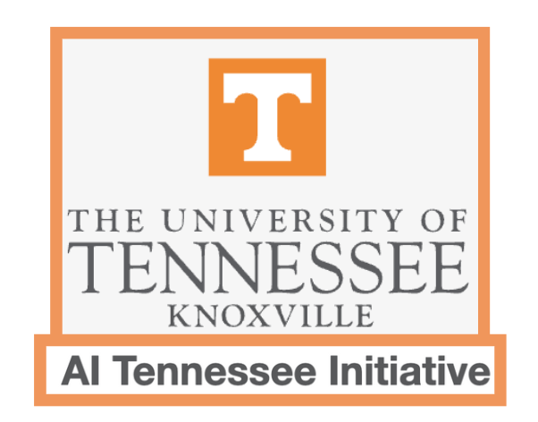
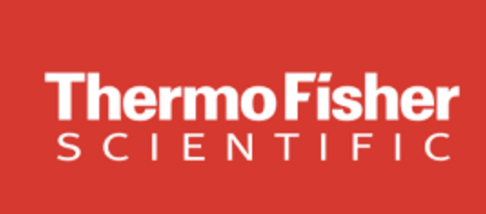
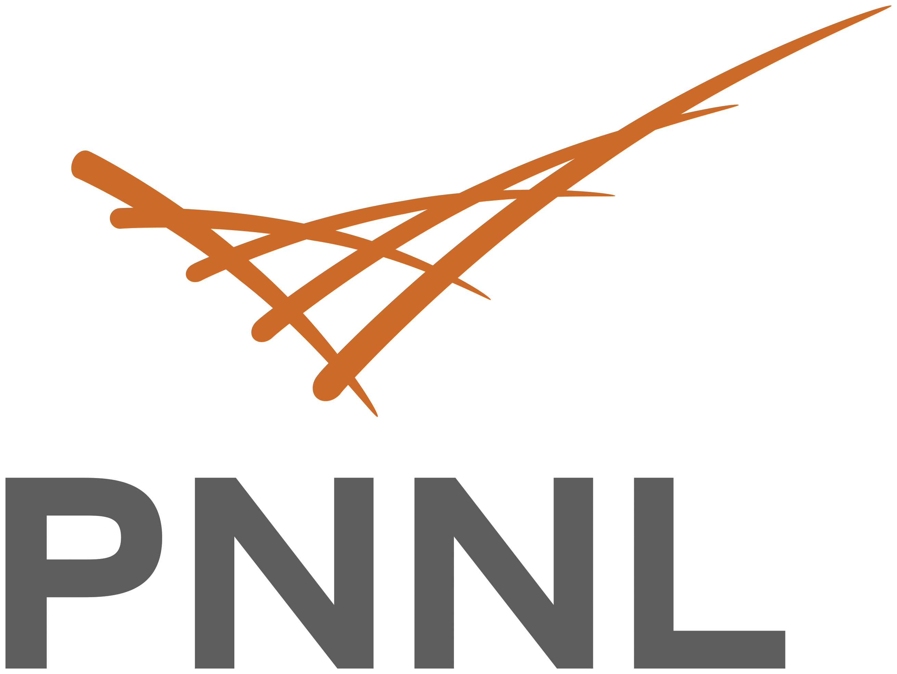
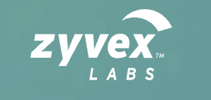
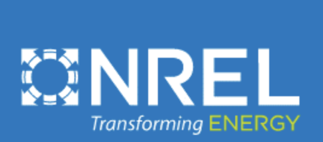
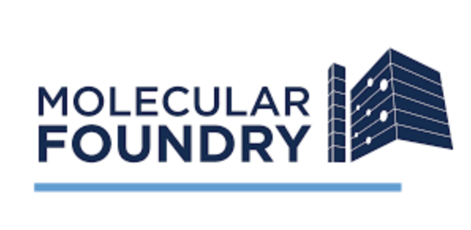
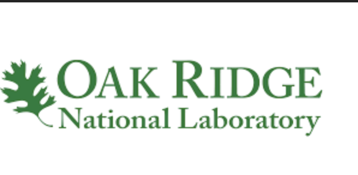

{:.secondary}
# {{ site.event_date }}

Participation is FREE and open. Let’s build the future of microscopy together!

The closing date for applications is November 1 2024.

    

    <h2><i class="bi bi-calendar3"></i> Event timeline</h2>
    <dl>
        
            <dd>
                Applications open for participants 
                
                    <a href="{{ site.baseurl }}" class="btn">Registration page</a>
                
                    <a class="btn disabled">Registration has closed</a>
                
                    <a class="btn disabled">Registration opens soon</a>
                
            </dd>
        

        <dt>{{ site.registration_closes_date }}</dt>
        <dd>Applications close</dd>

        <dt>{{ site.event_date }}</dt>
        <dd>Hackathon date</dd>
    </dl>



The hackathon is open to everyone, regardless of background or experience. Our North Star goal is to build the bridge between microscopy and machine learning communities. For microscopists, we welcome participation from all field - electron, scanning probe, chemical imaging, and all stages of the microscope workflow from sample selection to microscope optimization, data analytics, in-line analysis, automated experimentation, and interpretation. From machine learning community, we welcome experts in image analysis, optimization, and active learning. Let’s build the window between machine learning and nanoscale world together!

Prior programming experience is not required, but it is recommended for coding projects. We provide the starting materials on the resource page, To learn about the types of projects within the scope of the hackathon, go to the submission page.  During the hackathon, the organizers will be available to support you. After the hackathon, we plan to integrate the projects in scholarly publication. If you are interested in supporting the hackathon as an organizer or acting as a judge, please indicate so on the registration form.

## Logistics

The event will take place virtually, using a combination of **video conferencing** (Zoom) for meetings and seminars, and **discussion forums** (Slack, Miro). Slack, Miro, and Zoom links will be shared upon registration. 

## Prizes

Will be announced soon! 





##  Gold Sponsor 

    
    

## Silver Sponsor

    

## Partners

    
    
    
    
    

#### Please get in touch if you would like to be a sponsor at [sergei2@utk.edu](mailto:sergei2@utk.edu)